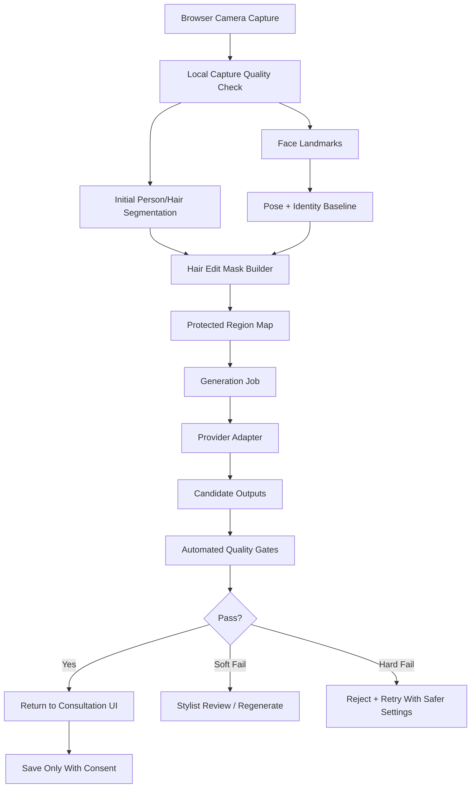

# Hair Twin AI Generation Design

Date: 2026-07-01

## 1. Recommendation

Hair Twin should use a controlled image-editing pipeline, not free-form image generation.

The MVP generation method should be:

1. Capture a real customer image.
2. Detect face landmarks and image quality locally.
3. Segment hair, face, body, and background regions.
4. Build a protected-region map.
5. Generate only inside the hair-edit region.
6. Score the result for identity preservation and non-hair preservation.
7. Return 2-4 accepted candidates to the stylist.

In short:

`real capture -> masks -> provider image edit -> automated QC -> stylist review -> save/discard`

The key technical principle is:

> Hair Twin must preserve the person and edit the hairstyle. The model is allowed to change hair length, shape, volume, curl, color, and texture. It is not allowed to change face identity, facial structure, skin tone, expression, clothing, background, or body.

## 2. Why Free-Form Generation Is Wrong

Do not ask an image model to create "this person with a bob haircut" from prompt and source image alone.

That approach is risky because:

- It may alter the customer's identity.
- It may beautify or stylize the face.
- It may change background, clothes, lighting, and skin tone.
- It is hard to explain to a stylist why the output changed.
- It creates unrealistic expectation and liability risk.

Hair Twin needs a consultation-grade visual, not a social-media makeover.

## 3. Generation Modes

### Mode A: Hair-Only Inpainting

Use for:

- Changing length.
- Adding bangs.
- Changing silhouette.
- Adding volume, waves, curls, or straight texture.
- Changing hair color when geometry also changes.

Input:

- Original customer image.
- Hair edit mask.
- Protected face/body/background mask.
- Style preset.
- Negative constraints.

Output:

- 2-4 candidates with metadata.

This should be the default generation mode.

### Mode B: Color-Only Transfer

Use for:

- Dye color previews.
- Tone comparison.
- Highlight/ombre/balayage tests.

Input:

- Original image.
- Hair mask.
- Target color recipe.

Output:

- A color-adjusted version that preserves original hair structure.

This can often be cheaper and more reliable than full generative editing. Use deterministic image processing first, then generative enhancement only if needed.

### Mode C: Reference-Style Adaptation

Use for:

- Customer brings celebrity or inspiration image.
- Stylist wants similar mood, not exact copy.

Input:

- Original customer image.
- Reference hairstyle image.
- Extracted reference attributes: length, bangs, parting, silhouette, curl, color, volume.
- Hair edit mask.

Output:

- Candidate images matching extracted attributes, while preserving customer identity.

Important:

- Do not copy a celebrity/person identity.
- Convert the reference into hairstyle attributes.

### Mode D: Turnaround Reference Synthesis

Use for:

- Side/back reference consultation.
- Explaining layer, volume, and nape/side silhouette.

MVP rule:

- Do not claim true 3D reconstruction.
- Treat side/back outputs as "style reference views", not exact predicted views of the same head.

Input:

- Accepted front-view style.
- Style preset.
- Optional salon reference asset.

Output:

- Side/back consultation references labeled clearly as generated references.

## 4. Pipeline Architecture



## 5. Capture And Preflight Checks

Before image generation, the browser should validate:

- Exactly one visible face.
- Face is centered.
- Face angle within acceptable range.
- Eyes/nose/mouth landmarks detected.
- Hair region visible enough.
- Lighting is not too dark, overexposed, or strongly backlit.
- No severe motion blur.
- Minimum image resolution is met.

Recommended local tools:

- MediaPipe Face Landmarker for landmarks, pose, and real-time guidance.
- MediaPipe Image Segmenter for first segmentation pass.
- Later: ONNX Runtime Web + WebGPU for heavier local segmentation if browser performance is acceptable.

Why local preflight matters:

- Reduces API cost.
- Avoids uploading unusable face images.
- Lets stylist fix capture conditions immediately.
- Protects trust before generation starts.

## 6. Mask Strategy

Hair Twin needs more than one mask.

### Required Masks

`hair_current_mask`

- Current visible hair.
- Used as the seed for the edit region.

`hair_expansion_mask`

- Plausible area where new hair may grow or extend.
- Needed for longer hairstyles, bangs, and volume changes.

`face_protect_mask`

- Eyes, brows, nose, mouth, cheeks, jaw, skin region.
- Must not be changed.

`body_clothing_protect_mask`

- Neck, shoulders, clothing.
- Must not be changed except minimal occlusion where long hair naturally overlaps.

`background_protect_mask`

- Salon background.
- Must remain stable.

`uncertain_boundary_mask`

- Soft edge around hair and face.
- Used to allow natural blending but trigger extra QC.

### Hair Edit Mask Construction

Build the edit mask as:

`hair_edit_mask = hair_current_mask + allowed_expansion - face_protect_mask - protected_background - protected_body_core`

Then:

- Dilate hair mask slightly for blending.
- Erode face-protect mask conservatively.
- Keep eyes/brows/nose/mouth fully locked.
- Use a soft alpha boundary near hairline.
- Keep original image outside edit mask unchanged whenever provider supports masked editing.

## 7. Prompt Contract

Prompts should be generated from structured style presets, not free text.

### Style Preset Schema

```json
{
  "style_id": "medium_layered_c_cut",
  "display_name": "Medium layered C-curl",
  "category": "medium",
  "length": "collarbone",
  "bangs": "none",
  "parting": "natural side part",
  "silhouette": "soft layered oval silhouette",
  "texture": "smooth C-curl ends",
  "volume": "moderate crown volume",
  "color": {
    "family": "brown",
    "tone": "neutral ash brown",
    "level": 6
  },
  "salon_constraints": [
    "realistic Korean salon finish",
    "natural hair density",
    "consultation photo realism"
  ]
}
```

### Positive Prompt Template

```text
Edit only the hair inside the provided mask.
Preserve the same person, face identity, expression, skin tone, facial structure, pose, clothing, and background.
Create a realistic salon consultation preview of {style_display_name}.
Hair attributes: {length}, {bangs}, {parting}, {silhouette}, {texture}, {volume}, {color}.
The result should look like a practical salon outcome, not a beauty filter or fashion editorial.
Keep lighting and camera perspective consistent with the original photo.
```

### Negative Prompt / Prohibitions

```text
Do not change the face, eyes, nose, mouth, eyebrows, jaw, skin tone, expression, body, clothing, background, camera angle, or age.
Do not beautify the person.
Do not make the output look illustrated, cinematic, fantasy, plastic, airbrushed, or heavily retouched.
Do not add accessories.
Do not change the customer's identity.
```

### Korean Stylist Labels

The UI can show Korean salon terms, but the generation prompt should keep a normalized internal representation. This avoids inconsistent model interpretation of local hairstyle names.

Example:

- UI: `중단발 레이어드 C컬`
- Internal: `medium collarbone layered haircut, C-curl ends, natural volume`

## 8. Provider Adapter

The app should not call a single provider directly from product code.

Create an adapter interface:

```ts
type HairGenerationRequest = {
  jobId: string
  sourceImageUri: string
  masks: {
    hairEditMaskUri: string
    faceProtectMaskUri: string
    regionMapUri: string
  }
  stylePreset: HairStylePreset
  generationMode: "hair_inpaint" | "color_transfer" | "reference_style" | "turnaround_reference"
  seed?: number
  candidateCount: number
  constraints: {
    preserveIdentity: true
    preserveBackground: true
    preserveExpression: true
    allowHairExpansion: boolean
  }
}

type HairGenerationResult = {
  provider: string
  model: string
  modelVersion?: string
  candidates: Array<{
    imageUri: string
    seed?: number
    rawProviderMetadata: unknown
  }>
}
```

First adapters:

1. `openai_image_edit_adapter`
2. `manual_mock_adapter` for UI tests without API cost
3. `self_hosted_diffusion_adapter` placeholder for later

Candidate future adapters:

- Google / Vertex image models.
- Stability image editing.
- Replicate or fal-hosted open models.
- Internal GPU model.

## 9. Recommended MVP Provider Strategy

Start with managed image editing APIs, with OpenAI image editing as the first benchmark adapter.

Reason:

- Current OpenAI image docs support image generation/editing with text and image inputs.
- OpenAI's docs describe GPT Image models as able to understand text and images for generating/editing images.
- This lets us test Hair Twin's product risk quickly before operating our own GPU stack.

Do not commit to OpenAI as the permanent provider yet.

Benchmark at least:

- OpenAI image editing.
- One Google/Vertex image editing path if API access and terms are acceptable.
- One open/self-hostable diffusion pipeline if managed APIs fail hair-only control.

## 10. Self-Hosted Fallback Architecture

Move to self-hosted only if provider APIs fail quality, cost, latency, or data-handling requirements.

Likely components:

- Segmentation: SAM/SAM-family or hair-specific segmentation model.
- Identity preservation: face embedding model plus identity-preserving generation method.
- Conditioning: ControlNet-style spatial controls for mask, edges, pose, or segmentation.
- Image prompting: IP-Adapter-style reference conditioning.
- Identity plugin: InstantID/PhotoMaker-style identity conditioning for person preservation.
- Base generation: SDXL/Flux-class model or later open image model.
- Inpainting: mask-guided diffusion pipeline.

Why these matter:

- SAM introduced promptable zero-shot segmentation and is useful for interactive mask refinement.
- ControlNet adds spatial conditioning controls such as edges, depth, pose, or segmentation.
- IP-Adapter adds image-prompt conditioning without full model fine-tuning.
- InstantID and PhotoMaker are relevant because Hair Twin must preserve a person's identity without training a new model for every customer.

Self-hosted target:

`source image + hair mask + face landmarks + identity embedding + style attributes -> inpainted hair result`

## 11. Quality Control

Generation should produce more candidates than the UI shows.

Example:

- Generate 4 candidates.
- Run automatic QC.
- Show best 2.
- Keep rejected outputs hidden but logged.

### Hard-Fail Checks

Reject immediately if:

- Face count changes.
- Face landmark geometry changes beyond threshold.
- Identity similarity falls below threshold.
- Eyes, nose, mouth, or jaw move visibly.
- Skin tone changes materially.
- Background changes materially.
- Clothing changes materially.
- Hair result covers eyes/face unnaturally.
- Output has severe blur, distortion, or extra facial features.

### Soft-Fail Checks

Flag for stylist review if:

- Hairline is uncertain.
- Bangs placement is plausible but borderline.
- Hair volume extends beyond allowed expansion but still looks natural.
- Color is plausible but too saturated.
- Style does not match preset well.

### Suggested Metrics

Identity:

- Face embedding cosine similarity.
- Landmark distance normalized by face size.

Non-hair preservation:

- SSIM/LPIPS outside hair edit mask.
- Background pixel difference outside mask.

Hair quality:

- Hair mask coverage ratio.
- Edge artifact score near hair boundary.
- Blur/noise score.
- Prompt/style classifier score.

Human review:

- Same person? yes/no.
- Useful for consultation? 1-5.
- Stylist can explain feasibility? yes/no.
- Customer trust likely? 1-5.

## 12. Data Retention And Privacy

Default rule:

- Do not save source face images unless the customer explicitly consents.

Generation-time storage:

- Temporary source image.
- Temporary masks.
- Temporary generated candidates.
- Job metadata.

After session:

- If not saved: delete temporary source, masks, and candidates on schedule.
- If saved: keep selected outputs, final report, and consent record.
- Store raw source only if explicitly needed and consented.

Provider data rule:

- Review provider data handling before sending salon customer images.
- Prefer paid/API plans with no training on submitted data where contractually available.
- Never send images before consent.

## 13. Job Lifecycle

Statuses:

- `created`
- `preflight_failed`
- `queued`
- `masking`
- `generating`
- `quality_checking`
- `needs_stylist_review`
- `completed`
- `failed_retryable`
- `failed_hard`
- `expired`
- `deleted`

Retry policy:

- Retry once with stricter prompt and smaller edit mask.
- Retry once with a safer style variant.
- Stop after 2 retries and show a human-friendly failure reason.

Failure messages for UI:

- "촬영 각도가 맞지 않아 다시 촬영이 필요합니다."
- "얼굴 보존 기준을 통과하지 못해 결과를 숨겼습니다."
- "헤어 영역이 충분히 분리되지 않아 스타일을 다시 선택해 주세요."

## 14. Benchmark Plan

Build a small internal benchmark before committing to a provider.

Dataset:

- 20 clean portrait captures.
- 20 salon-like lighting captures.
- 10 difficult cases: glasses, bangs, curly hair, dyed hair, dark hair on dark background.
- 10 non-customer stock/consented test images for public demos.

Styles:

- Short bob.
- Medium layered C-curl.
- Long layered wave.
- Bangs/no bangs.
- Ash brown.
- Warm brown.
- Black gloss tone.
- Light highlight.

Each provider/pipeline generates:

- 4 candidates per image/style.

Score:

- Identity preservation.
- Non-hair preservation.
- Hair realism.
- Style accuracy.
- Latency.
- Cost per accepted output.
- Retry rate.
- Stylist usefulness.

Decision rule:

- Use a provider for MVP only if accepted-result rate is at least 70 percent and hard identity failures are near zero in manual review.

## 15. Implementation Phases

### Phase 0: Offline Spike

Goal:

- Prove one source image can become one trustworthy hairstyle output.

Build:

- Local script for mask prep.
- Provider adapter.
- QC notebook/script.
- 20-image test folder.

Exit:

- At least 10 before/after pairs worth showing in interviews.

### Phase 1: App-Connected Generation

Goal:

- Connect the salon UI to generation jobs.

Build:

- Job table.
- Storage paths.
- Worker polling.
- Realtime status.
- Candidate return.
- Save/discard.

Exit:

- Stylist can run a controlled mock consultation.

### Phase 2: Quality-Gated MVP

Goal:

- Prevent trust-breaking outputs from reaching customers.

Build:

- Face identity scoring.
- Non-hair preservation scoring.
- Automatic rejection.
- Human review state.
- Regeneration strategy.

Exit:

- Bad outputs are hidden or clearly marked before customer-facing display.

### Phase 3: Provider Benchmark And Self-Hosted Decision

Goal:

- Decide whether managed API is enough.

Build:

- Provider comparison harness.
- Cost/latency tracking.
- Quality dashboard.

Exit:

- Continue managed API, or start self-hosted GPU pipeline.

## 16. Initial Engineering Interfaces

### Python Worker Modules

```text
workers/ai-worker/
  app/
    main.py
    jobs/
      poller.py
      lifecycle.py
    masks/
      build_region_map.py
      refine_hair_mask.py
    providers/
      base.py
      openai_image_edit.py
      mock.py
    quality/
      face_identity.py
      landmark_delta.py
      non_hair_diff.py
      artifact_score.py
      style_match.py
    storage/
      supabase_storage.py
    schemas/
      generation.py
```

### Frontend Modules

```text
apps/web/src/features/generation/
  create-generation-job.ts
  generation-status-panel.tsx
  candidate-grid.tsx
  quality-badge.tsx
  regenerate-button.tsx
```

## 17. Source Notes

- OpenAI Images and vision docs: https://developers.openai.com/api/docs/guides/images-vision
- OpenAI Images API reference: https://developers.openai.com/api/reference/resources/images
- MediaPipe Face Landmarker web docs: https://developers.google.com/edge/mediapipe/solutions/vision/face_landmarker/web_js
- MediaPipe Image Segmenter web docs: https://developers.google.com/edge/mediapipe/solutions/vision/image_segmenter/web_js
- ONNX Runtime WebGPU docs: https://onnxruntime.ai/docs/tutorials/web/ep-webgpu.html
- Segment Anything paper: https://arxiv.org/abs/2304.02643
- ControlNet paper: https://arxiv.org/abs/2302.05543
- IP-Adapter paper: https://arxiv.org/abs/2308.06721
- InstantID paper: https://arxiv.org/abs/2401.07519
- PhotoMaker paper: https://arxiv.org/abs/2312.04461

