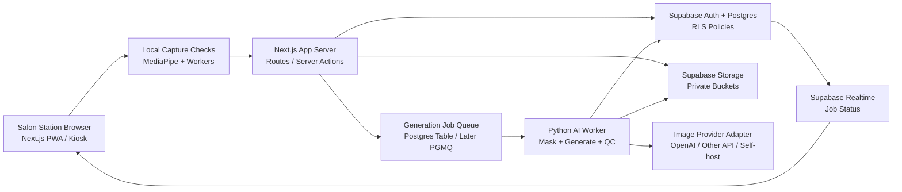

# Hair Twin System Design

Date: 2026-07-01

## 1. CTO Recommendation

Hair Twin should be built as a salon consultation system with a staged architecture:

1. Web-first salon MVP on PC/tablet/webcam.
2. Cloud-assisted AI generation with strict hair-only editing controls.
3. Private consultation records in Supabase.
4. Vercel preview deployments for product iteration.
5. Hardware mirror only after the software workflow proves salon pull.

The first product should not be a native mobile app, a full 3D simulator, or a custom mirror device. Those are later forms. The first proof should answer:

- Can a stylist capture a usable customer image quickly?
- Can the system preserve face identity while changing only hair?
- Can generated results be trusted enough for consultation?
- Can the customer and stylist compare options without awkward waiting?
- Can the salon save only what it has consent to save?

## 2. Recommended Stack

### Frontend

Recommended:

- Next.js App Router + TypeScript
- Tailwind CSS + shadcn/ui primitives
- Browser camera capture through `getUserMedia`
- MediaPipe Tasks Vision for face landmarks and first-pass segmentation
- Web Workers for camera-frame analysis so the UI does not freeze
- Optional ONNX Runtime Web / WebGPU later for heavier local inference
- PWA/kiosk mode for salon stations

Why:

- Next.js is a good fit once we need authentication, protected routes, server-side data access, API route handlers, Vercel preview links, and a real operator dashboard.
- React/Vite would be faster for a throwaway prototype, but Hair Twin needs stored sessions, reports, access control, and deployment soon. Starting with Next.js avoids a rewrite.
- The camera and landmark layer should run in-browser where possible. This reduces upload of bad images and lets the stylist fix lighting, angle, and framing before any server call.

Current source notes:

- Next.js docs list App Router as the current app model and show current setup defaults: TypeScript, Tailwind, ESLint, App Router, Turbopack, and `@/*` alias.
- MediaPipe Face Landmarker supports web/JavaScript, image and video modes, 3D landmarks, blendshapes, and transformation matrices.
- MediaPipe docs warn that face/segmentation calls can block the UI thread, so Web Workers should be part of the capture architecture.

### Backend

Recommended:

- Supabase Postgres for core relational data
- Supabase Auth for salon/stylist accounts
- Supabase Storage for private source/generated/report images
- Supabase Realtime for generation job status
- Supabase Edge Functions for short orchestration endpoints
- Python AI worker service for long-running image generation and quality scoring

Why:

- Supabase gives us Postgres, RLS, Auth, Storage, Realtime, and Edge Functions in one stack, which is ideal for a B2B MVP with privacy-sensitive image records.
- Edge Functions are good for small authenticated endpoints and external API orchestration, but not for heavy image-generation workloads. The AI worker should be separate.
- Realtime can push job status to the salon UI, avoiding manual refresh during generation.

Important backend boundary:

- Next.js handles app UI and user-facing server actions.
- Supabase owns durable state and permissions.
- Edge Functions handle small orchestration calls and webhook-style tasks.
- Python AI workers handle GPU/API generation, mask processing, quality scoring, retries, and generated asset upload.

### AI / Computer Vision

Recommended MVP pipeline:

1. Capture image in browser.
2. Run local face-landmark and framing checks.
3. Run local or server-side hair/person segmentation.
4. Create an editable hair mask and protected face/body/background regions.
5. Send source image, hair mask, selected style preset, and prompt metadata to a provider-agnostic generation adapter.
6. Generate 2-4 candidate outputs.
7. Run automated quality gates.
8. Return only acceptable outputs to the consultation UI.
9. Let stylist save, discard, regenerate, or annotate.

Recommended first generation path:

- Use managed image editing/generation APIs first.
- Keep a provider adapter layer so we can compare OpenAI, Google/Vertex, Stability, Replicate/fal-hosted workflows, or self-hosted diffusion later.
- Do not self-host GPU models until we have quality benchmarks, latency targets, and usage volume.

Why:

- Hair Twin's hardest technical risk is not generic image generation. It is controlled identity-preserving, hair-only transformation in a salon workflow.
- Managed APIs let us test quality and UX before paying the complexity cost of model hosting.
- A provider adapter prevents lock-in and gives us a fair benchmark path.

AI worker stack:

- Python 3.12+
- FastAPI for worker API if needed
- Celery/RQ/Arq or a simple Postgres-backed polling worker in the earliest MVP
- Pillow/OpenCV for image operations
- PyTorch only when self-hosted models become necessary
- ONNX Runtime for optimized local/server inference where appropriate
- Structured job logs and quality metrics persisted to Postgres

### Infrastructure

Recommended:

- Vercel for Next.js preview/production deployments
- Supabase hosted project for Postgres/Auth/Storage/Realtime
- GPU/API provider for generation worker in early MVP
- Later: dedicated GPU workers on RunPod, Modal, AWS/GCP/Azure, or Korean cloud if data residency becomes a buyer requirement

Why:

- Vercel + Supabase gives fast product iteration and easy preview sharing.
- GPU inference is operationally different from web app hosting. It should not be hidden inside the Next.js app.
- If Korean salons or franchise HQs require stricter data handling, move AI processing and storage to a region/infra arrangement reviewed by counsel.

## 3. High-Level Architecture



## 4. Core Product Flow

### Consultation Flow

1. Stylist starts a consultation session.
2. Customer sees short consent copy before capture.
3. Browser camera opens with live framing guidance.
4. Local checks validate face visibility, lighting, angle, and distance.
5. Stylist captures source image.
6. The app creates a temporary preview session.
7. Customer/stylist chooses style preset and color.
8. System generates candidate images.
9. Quality gate rejects outputs that alter face, background, expression, clothing, or non-hair regions too much.
10. UI shows accepted candidates side by side.
11. Stylist adds feasibility, price, time, and care notes.
12. Customer chooses save or discard.
13. If saved, report and assets are stored under salon/customer permissions.
14. If not saved, raw capture and generated previews expire quickly.

### UI Modes

Customer-facing mode:

- Large visual comparison
- Simple before/after
- Calm expectation language
- No technical controls

Stylist mode:

- Style preset filters
- Generation controls
- Feasibility notes
- Price/time/care fields
- Regenerate/save/report actions

Owner/admin mode:

- Salon staff management
- Style preset management
- Usage summary
- Consultation history policy
- Privacy/deletion tools

## 5. Data Model Draft

Core tables:

- `organizations`
- `salons`
- `profiles`
- `salon_memberships`
- `customers`
- `consent_records`
- `consultation_sessions`
- `source_images`
- `style_presets`
- `generation_jobs`
- `generated_assets`
- `quality_checks`
- `consultation_notes`
- `reports`
- `audit_events`

Important design choices:

- `customers` should allow pseudonymous records. A salon should not need full customer identity for every consultation.
- `source_images` and `generated_assets` should live in private storage buckets, not public URLs.
- `consent_records` must be immutable except revocation metadata.
- `generation_jobs` should store model/provider/version/prompt/mask metadata for auditability.
- `audit_events` should log sensitive actions: capture, save, delete, export, report creation, and staff access.

Initial RLS model:

- Organization owner can manage salons and staff.
- Salon staff can read/write sessions only for their salon.
- Customers should not have direct database access in MVP unless a customer portal is created.
- Service role is used only by trusted server/worker code, never client code.
- Every table in exposed schemas must have RLS enabled.

Storage buckets:

- `source-images-private`
- `generated-assets-private`
- `reports-private`
- `style-reference-assets`

Retention defaults:

- Unsaved source images: delete within 24 hours or sooner.
- Saved source images: store only with explicit consent and visible retention period.
- Generated outputs: save only selected/approved assets by default.
- Reports: retained per salon policy and customer request.

## 6. AI Quality Gates

A generated result is acceptable only if it passes both automated and human checks.

Automated checks:

- Face bounding box remains stable.
- Face landmarks do not shift beyond a threshold.
- Identity embedding similarity remains above threshold.
- Non-hair region structural similarity remains high.
- Hair mask coverage changes in plausible regions only.
- Background/clothing/skin tone changes are below threshold.
- Output is not blurred, over-smoothed, distorted, or heavily beautified.
- Image contains exactly one primary face.

Human/stylist checks:

- Does the result look like the same customer?
- Does the hair structure make salon sense?
- Is color/length/style plausible for the customer's current hair?
- Is the output clearly positioned as consultation aid, not guarantee?

Quality status values:

- `accepted`
- `needs_stylist_review`
- `regenerate`
- `blocked_identity_changed`
- `blocked_non_hair_changed`
- `blocked_low_realism`
- `blocked_policy_or_safety`

## 7. Model Strategy

### Phase 1: Provider Benchmark

Test 3-5 generation providers/pipelines against the same dataset:

- 20 controlled test portraits
- 10 salon-lighting captures
- 10 difficult cases: bangs, glasses, dyed hair, dark background, curly hair, masks/occlusions if relevant
- 10 target styles

Benchmark dimensions:

- Identity preservation
- Hair-only edit control
- Hair realism
- Style accuracy
- Color accuracy
- Latency
- Cost per accepted output
- Failure/retry rate
- API/data handling terms

### Phase 2: Hybrid Pipeline

If managed APIs are good enough:

- Keep API generation.
- Improve masks, prompts, retry logic, quality scoring, and UX.

If managed APIs fail hair-only precision:

- Build a custom pipeline with segmentation + identity conditioning + mask-guided diffusion/editing.
- Host a GPU worker.
- Train or fine-tune only after collecting consented internal benchmark data.

### Phase 3: Specialized Hair Model

Only after pilot data:

- Curate consented image/result pairs.
- Build a salon-specific evaluation set.
- Explore fine-tuning, LoRA, ControlNet-like conditioning, or custom segmentation.
- Build an internal model registry and evaluation dashboard.

## 8. Hardware Plan

### Phase 0: Development Rig

Purpose:

- Prove software flow and generation quality.

Components:

- Developer laptop or desktop.
- External 1080p/4K webcam.
- Basic soft lighting.
- Browser-based capture.

### Phase 1: Salon Pilot Kit

Purpose:

- Prove live salon workflow without custom mirror risk.

Components:

- Touchscreen tablet or 24-32 inch touch display.
- High-quality RGB webcam mounted at stable seated-face height.
- Soft frontal lighting, color temperature controlled.
- Small PC or laptop hidden behind station.
- Stable stand with cable management.

Design rule:

- The pilot kit should feel premium but remain replaceable. Do not commit to industrial design before observing real salon use.

### Phase 2: Mirror Prototype

Purpose:

- Test whether the mirror form factor increases buyer value after software is proven.

Components:

- 32-43 inch high-brightness display.
- Semi-transparent mirror/glass panel.
- Integrated camera position aligned near eye level.
- LED lighting module.
- Touch or external stylist controller.
- Windows mini PC or GPU-capable embedded PC depending on local inference needs.

Engineering risks:

- Camera through/around mirror glass.
- Salon lighting reflections.
- Display brightness behind mirror glass.
- Touch interaction on mirrored surface.
- Heat and ventilation.
- Cleaning and durability.
- Installation and maintenance.

Hardware gate:

- Start Phase 2 only after at least 3 salons complete software/tablet pilots and at least 2 buyers say the mirror form factor would increase willingness to pay.

## 9. Security And Privacy Design

Hair Twin handles face images and potentially biometric-like data. Treat privacy as product architecture, not just legal copy.

Minimum controls:

- Explicit consent before capture.
- Separate consent for saving images/reports.
- Clear "preview only" path that does not save raw face images.
- Easy deletion flow.
- Private buckets only.
- Signed URLs with short expiration for display.
- RLS on all exposed tables.
- No service-role key in browser.
- Audit log for sensitive actions.
- Provider/data-processing review before sending face images to external AI APIs.
- Formal Korean privacy/legal review before commercial launch.

Customer-facing wording principle:

- "This is a consultation preview to help discussion. It does not guarantee the final result."

## 10. Recommended Repository Shape

When implementation begins:

```text
apps/
  web/
    src/
      app/
      components/
      features/
        capture/
        consultation/
        generation/
        reports/
      lib/
        supabase/
        media/
        permissions/
        validation/
      workers/
        face-landmark.worker.ts
        segmentation.worker.ts
packages/
  shared/
  db/
  ai-contracts/
workers/
  ai-worker/
    app/
      main.py
      providers/
      quality/
      masks/
      storage/
supabase/
  migrations/
  seed.sql
docs/
  architecture/
  privacy/
```

For a smaller first cut, use a single Next.js app plus `workers/ai-worker`, then split packages only when duplication appears.

## 11. Implementation Roadmap

### Sprint 0: Technical Spike

Goal:

- Prove capture + mask + one generated output.

Build:

- Next.js camera capture screen.
- MediaPipe face landmark validation.
- Basic segmentation/mask creation.
- Provider adapter stub.
- One real image-edit API call.
- Store nothing by default.

Exit criteria:

- Generate at least 10 realistic before/after examples.
- Document failure cases.
- Measure latency and cost.
- Confirm whether managed API output is good enough for salon reaction tests.

### Sprint 1: Consultation MVP

Build:

- Salon login.
- Consultation session.
- Consent step.
- Capture guidance.
- Style preset selection.
- Generation job table.
- AI worker.
- Realtime job status.
- Result comparison.
- Save/discard.
- Stylist notes.

Exit criteria:

- A stylist can complete a mock consultation without developer help.
- Results are saved only after explicit save consent.
- Failed generations are visible and recoverable.

### Sprint 2: Report And Pilot Readiness

Build:

- Final consultation report.
- Deletion flow.
- Basic salon admin.
- Usage logs.
- Quality checklist.
- Pilot data export.

Exit criteria:

- Ready for controlled salon pilot.
- Privacy review checklist completed.
- Known model limitations written in product language.

### Sprint 3: Hardware Pilot Kit

Build:

- Touch/kiosk display mode.
- Camera/light calibration checklist.
- Offline/slow-network states.
- Salon setup guide.

Exit criteria:

- Can install and use in a salon-like environment.
- Staff can recover from bad capture/generation states.

## 12. Stack Decisions

### Use Next.js instead of native app first

Reason:

- Faster iteration, easier deployment, web camera support is enough for MVP, and Vercel previews help stakeholder review.

Reversal trigger:

- If kiosk/browser camera control or hardware integration becomes limiting, consider Electron/Tauri shell or native Windows app for salon stations.

### Use Supabase instead of custom backend first

Reason:

- Postgres/RLS/Auth/Storage/Realtime are exactly the MVP's needs.

Reversal trigger:

- If enterprise/franchise buyers require custom VPC, on-premise, or strict data residency, move to self-hosted Supabase or cloud-native Postgres/S3/Auth architecture.

### Use managed image APIs before self-hosted diffusion

Reason:

- We need to validate trust and workflow before owning GPU ops.

Reversal trigger:

- If API quality, cost, latency, or data terms fail MVP requirements.

### Use tablet/webcam before mirror hardware

Reason:

- Hardware adds cost, installation, repair, heat, brightness, reflection, and support risk before demand is proven.

Reversal trigger:

- If buyers explicitly require mirror form factor to pay and software value is already proven.

## 13. Key Risks

| Risk | Why it matters | Control |
| --- | --- | --- |
| Face identity changes | Destroys trust | Mask constraints, identity scoring, automatic rejection |
| Hair looks fake | Weakens consultation value | Provider benchmark, style presets, stylist review |
| Generation latency too long | Breaks chair workflow | Async job UI, candidate browsing during wait, latency SLO |
| Raw face data over-stored | Privacy/legal exposure | Temporary by default, explicit save consent, retention policy |
| Salon staff cannot explain limits | Liability risk | Product copy, report disclaimer, staff training |
| Hardware too early | Burns cash and focus | Tablet/webcam pilots first |
| Realtime scaling limits | Job status delays | Use Realtime only for job state; benchmark before scale |
| Vendor lock-in | Model/API changes | Provider adapter and benchmark harness |

## 14. Initial Success Metrics

Technical:

- Capture-to-first-accepted-result p50 under 45 seconds, p95 under 90 seconds.
- Accepted generation rate above 70 percent after automatic QC.
- Identity rejection false negative rate near zero in manual review.
- Unsaved raw image deletion verified.

Product:

- Stylist completes consultation in under 5 minutes.
- Customer says result is believable enough to discuss.
- Stylist can explain feasibility from the output.
- Owner sees a reason to pilot or pay.

## 15. Source Notes

- Next.js installation and App Router docs: https://nextjs.org/docs/app/getting-started/installation
- Vercel deployments: https://vercel.com/docs/deployments
- MediaPipe Face Landmarker web docs: https://developers.google.com/edge/mediapipe/solutions/vision/face_landmarker/web_js
- MediaPipe Image Segmenter web docs: https://developers.google.com/edge/mediapipe/solutions/vision/image_segmenter/web_js
- ONNX Runtime WebGPU docs: https://onnxruntime.ai/docs/tutorials/web/ep-webgpu.html
- OpenAI Images and vision docs: https://platform.openai.com/docs/guides/images
- OpenAI Images API reference: https://platform.openai.com/docs/api-reference/images
- Supabase RLS docs: https://supabase.com/docs/guides/database/postgres/row-level-security
- Supabase Storage access control docs: https://supabase.com/docs/guides/storage/security/access-control
- Supabase Realtime Postgres changes docs: https://supabase.com/docs/guides/realtime/postgres-changes
- Supabase Edge Functions docs: https://supabase.com/docs/guides/functions
- Korean Personal Information Protection Commission: https://www.pipc.go.kr/eng

